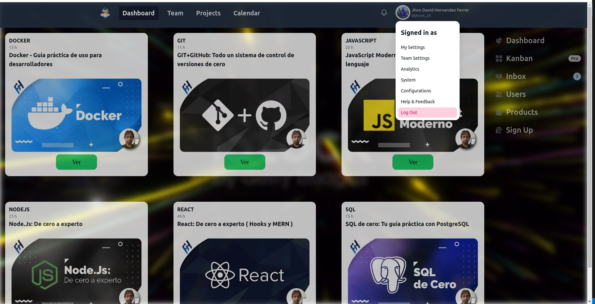

# Eduvverse

### Objectives Specific

Develop an educational learning platform that facilitates the acquisition of knowledge through audiovisual content, promoting an interactive and enriching environment for users.


| Objectives General                                           |
| ------------------------------------------------------------ |
| Create an application in which some courses and their videos can be viewed. |
| Have the functionality of being able to comment on the videos. |
| Creation of a creative and intuitive interface for users.    |


## Project description

This project aims to create a free course platform using React, inspired by the basic operation of Udemy. Our platform will allow users to access a wide range of online courses for free, providing an accessible and flexible learning experience, just like Udemy, but without associated costs.

We have the proposal to develop a free course platform based on React, taking as inspiration the fundamental operation of the successful Udemy platform. Our vision is to provide users with an accessible and versatile online learning experience, similar to what Udemy offers, but without any associated costs. The platform will offer a wide variety of courses in various areas, from technology to art and music, allowing students to access quality resources without financial barriers. Additionally, we plan to incorporate interactive features and progress tracking tools to improve the user experience and encourage effective and personalized learning.


- Comando para correr los estilos de tailwind

``` cmd
npx tailwindcss -i ./src/index.css -o ./dist/output.css --watch
```

# Importante tener en cuenta
## Version de npm sobre la que esta el proyecto
``` cmd
npm --version
10.1.0 
```

## Version de node sobre la que esta el proyecto
``` cmd
node --version
v18.18.0
```
- Una vez seguros de tener estas versiones instalamos las dependencias necesarias.
```cmd
npm i o npm update

```


Correr el frontend

``````
npm run dev
``````


Correr el backend

``````
npm run serve
``````


# Como funciona la aplicacion

### El inicio de la aplicacion nos dara la obcion de loguearnos por discord.


### Una vez estamos logueados dentraremos a la pagina principal que nos mostrara todos los cursos disponibles


### Si ingresamos a mirar un curso nos mostrara el curso selecionado y reproduciendo por defecto el primer video del curso


### Y podras terminar tu session dandole click al perfil de usuario y en el boton logOut


